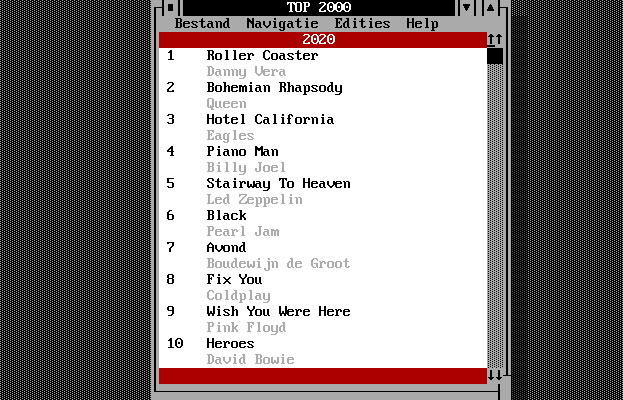

# Top2000 App voor MS-DOS

 

De Top2000 app is er nu ook voor MS-DOS. Waarom? Omdat het kan en we zaten door het coronavirus toch in lockdown. Alle edities tot en met 2019 zijn te bewonderen in deze mooie DOS app.

Gemaakt met [Visual Basic 1.0 for DOS](https://winworldpc.com/product/microsoft-visual-bas/10-for-dos). Alle code zit in deze repository. De data voor de app wordt uitgelezen in een ISAM database. Kijk op https://dos.top2000.app voor meer informatie. Release van deze software kunt u op [site](https://dos.top2000.app/downloads) vinden. 
